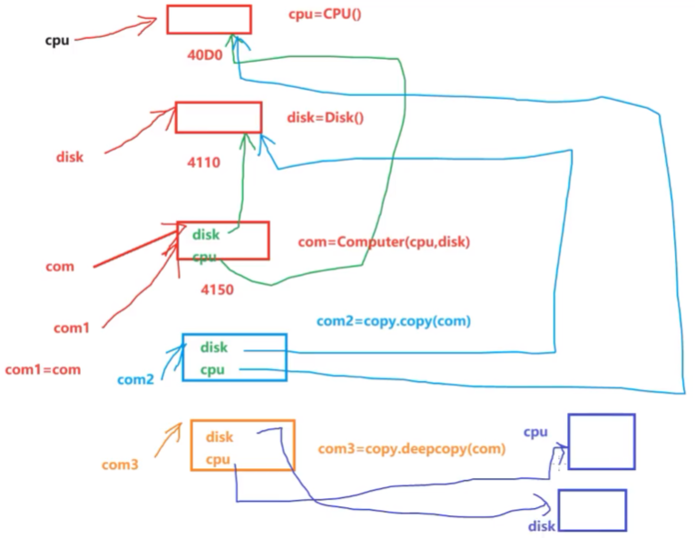

# 类的组成
类属性   -> 直接定义在类中，方法外的变量  
实例属性 -> 定义在_init__方法中，使用self打点的变量  
实例方法 -> 定义在类中的函数，而且自带参数self  
静态方法 -> 使用装饰器@staticmethod修饰的方法  
类方法   -> 使用装饰器@classmethod修饰的方法  
***
# 面向对象的三大特征
 **封装，继承，多态**  
 **权限控制:** 是通过对属性或方法添加单下划线、双下划线以及首尾双下划线来实现  
**单下划线开头:** 以单下划线开头的属性或方法表示protected受保护的成员，这类成员被视为仅供内部使用，允许类本身和ATM子类进行访问，但实际上它可以被外部代码访问。  
**双下划线开头:** 表示private私有的成员，这类成员只允许定义该属性或方法的类本身进行访问  
**首尾双下划线:** 一般表示特殊的方法
***
 **继承**  
· 在Python中一个子类可以继承N多个父类  
· 一个父类也可以拥有N多个子类  
· 如果一个类没有继承任何类，那么这个类默认继承的是object类  
继承的语法结构：  
class 类名(父类1,父类2...,父类N):  
&emsp;&#8195;pass
***
 **方法重写**  
· 子类继承了父类就拥有了父类中公有成员和受保护的成员  
· 父类的方法法并不能完全适合子类的需要求这个时候子类就可以重写父类的方法  
· 子类在重新父类的方法时，要求方法的名称必须与父类方法的名称相同，在子类重写后的方法中可以通过super().xxx()调用父类中的方法
***
 **多态**  
· 指的就是“多种形态”，即便不知道一个变量所引l用的对象到底是什么类型，仍然可以通过这个变量调用对象的方法  
· 在程序运行过程中根据变量所引用对象的数据类型，动态决定调用多态哪个对象中的方法  
· Python语言中的多态，根本不关心对象的数据类型，也不关心类之间是否存在继承关系，只关心对象的行为（方法）。只要不同的类中有同名的方法，即可实现多态  
***
 **object类**  
· 所有类直接或间接的父类  
· 所有类都拥有object类的属性和方法  
|  object类中特殊的方法  |  功能描述  |
| :-: | :-: | 
| __new__()  | 由系统调用，月用于创建对象 |
| __init__() | 创建对象时手动调用，用于初始化对象属性值 |
| __str__()  | 对象的描述，返回值是str类型，默认输出对象的内存地址 |
***
 **特殊方法**  

| 运算符 |  特殊方法  |  功能描述  |
| :-: | :-: | :-: |
| +  | __add__() | 执行加法运算 |
| -  | __sub__() | 执行减法运算 |
| <, <=, == | __lt__(), __le__(), __eq__() | 执行比较运算 |
| >, >=, != | __gt__(), __ge__(), __ne__() | 执行比较运算 |
| *, / | __mul__(), __truediv__() | 执行乘法运算，非整除运算 |
| %, // | __mod__(), __floordiv__() | 执行取余运算，整除运算 |
| ** | __pow__() | 执行幂运算 |
***
 **特殊属性**  

|  特殊属性  |  功能描述  |
| :-: | :-: |
| obj.__dict__ | 对象的属性字典 |
| obj.__class__ | 对象所属的类 |
| obj.__bases__ | 类的父类元组 |
| obj.__base__ | 类的父类 |
| obj.__mro__ | 类的层次结构 |
| obj.__subclasses__() | 类的子类列表 |
***
 **类的深拷贝与浅拷贝**  

**变量的赋值：** 只是形成两个变量，实际上还是指向同一个对象；  
**浅拷贝：** 拷贝时，对象包含的子对象内容不拷贝，因此，源对象与拷贝对象会引用同一个子对象；  
**深拷贝：** 使用copy模块的deepcopy函数，递归拷贝对象中包含的子对象，源对象和拷贝对象所有的子对象也不相同；  
练习图片解析：

***
 **本章总结**  

**程序设计的两大思想**  
· 面向过程：功能的封装，解决问题的思维方式为线性思维  
· 面向对象：属性和行为的封装，解决问题的思维方式为参与者（类和对象）  
· 面向过程与面向对象二者相辅相成，解决复杂问题通过面向对象方式便于从宏观上把握事物之间复杂的关系，方便分析整个系统，具体到微观操作，仍然使用面向过程方式来处理  
Python中一切皆对象，可通过内置函数type()查看对象的数据类型
**自定义类的语法**  
class 类名(父类1,父类2.,..,父类N):  
&emsp;&#8195;pass  
**创建对象的语法**  
&emsp;&#8195;对象名=类名(参数列表)  
类中可以编写类属性、实例属性、实例方法、类方法以及静态方法  
类是模板，一个类可以创建N多个对象，每个对象的属性名称相同，属性值各不相同  
Python是动态语言，在创建对象之后，可以动态的绑定属性和方法  
**访问权限控制**  
· 单下划线：以单下划线开头，表示protected受保护的成员，只允许类本身和子类进行访问，可以通过对象名去访问  
· 双下划线：双下划线表示private私有的成员，只允许定义该方法的类本身访问，不能通过类的对象访问，但可以通过"对象名._类名__xxx"方式访问  
· 首尾双下划线：表示特殊的方法，一般是系统定义的名字  
**面向对象的三大特征**  
· 封装：隐藏内部细节，提高程序的安全性（健壮性）  
· 继承：实现代码的复用（重复使用），通过继承可以理顺类与类之间的关系  
· 多态：不关心对象的数据类型，不关心是否具有继承关系，只关心对象的行为（方法），提高程序的可扩展性和可维护性  
object类是所有类直接或间接的父类，所有类都拥有object类的属性和方法  
类的深拷贝与浅拷贝